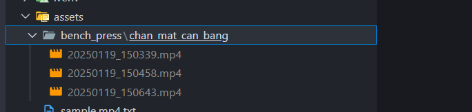

### Bước 1: Tải video về và lưu vào đây


### Bước 2: Trích xuất tất cả frames của các video
- Cần chạy cell để extract toàn bộ frame của các video ra trước

### Bước 3: Cuộn xuống cell Tool
- Thay đổi `human_name` và `input_folder` trước khi chạy cell: 

    ```python
    window(frames_extraction_folders[0], data_output_folder, current_labels, primary_label)
    ```
- Nếu sau khi close cửa sổ mà Kernel bị die thì phải thay `input_folder` thủ công vào để chạy, ví dụ: `'frames_extraction/bench_press/chan_mat_can_bang/20250121_221346'`. Chú ý phải đúng đường dẫn của mình